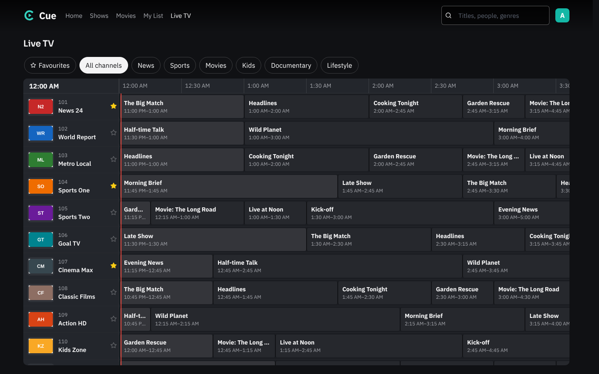

# Watch

Watch is the streaming side of Cue. Open it with **Watch** at the top of any page, or go to `/watch`. It looks and works like a streaming service: a banner, rows of artwork to scroll through, a search box, and a **Play** button on everything.

It needs [Premiumize](downloads.md#premiumize) (the player streams straight from Premiumize; nothing is downloaded to your server) and, for IMDb ratings, an optional OMDb key.

## Streaming only

Cue starts as a streaming app: opening it goes to **Who's watching?** and then Watch, and Settings shows only what streaming needs:

- **Streaming**: Premiumize, stream add-ons (Comet...), picture quality (best, up to 1080p, or up to 720p as a data saver on hotspots), and the switch below.
- **Torrent sites**: the fallback search when no add-on has a stream.
- **Movie info and ratings**: the TMDB key, and OMDb for IMDb ratings.
- **Accounts** and **System** (updates, backups, logs).

The library manager (downloading to this computer, Usenet, the torrent client and VPN, music, books, Plex/Jellyfin/Emby) is hidden and its automatic searches rest. Nothing is deleted: switch **Streaming only** off in Settings > Streaming and it all comes back. A new install can start with the full manager by setting `CUE_STREAMING_ONLY=0`.

## Profiles

Cue works like Netflix for a household: one sign-in, then **Who's watching?** and a profile per person. Each profile has its own Continue Watching, My List and progress, so one person's show doesn't move another's along.

- **The main profile** is the account owner's (made from your account when you first open Watch). Only it can change settings, open the library manager, or add, edit and remove profiles. Cue checks this itself, so another profile can't get round it from the browser.
- **Add profiles** under your avatar (top right) > **Manage profiles**: a name and a color, up to 6.
- **Lock a profile with a PIN** (4 digits) in the same place. Put one on the main profile so nobody else can open settings. Changing a PIN signs every device out of that profile.
- **Switch profile** from the avatar menu. Each browser or TV remembers its own profile.
- A household with only one profile and no PIN skips the picker.

## What you can do

- **Browse.** Home has Continue Watching, My List, then trending, popular and genre rows of movies and shows. **Shows** and **Movies** at the top narrow it to one kind.
- **Search anything.** Type in the search box: every movie and show TMDB knows comes up, not only what's in your library.
- **Open a title.** Its page has the backdrop, description, IMDb and Rotten Tomatoes ratings (or TMDB's score), age rating, length, cast and genres, and **More like this**. A show has a season picker and its episodes, each with a thumbnail, description and length.
- **Press Play.** Cue picks the best version Premiumize can stream at once ([how it picks](downloads.md#play-streaming-from-premiumize)) and it starts. If one won't play, the next one is tried by itself.
- **Pick up where you stopped.** Where you are is saved every 15 seconds, per account. Play on a title you started says **Resume**; on a show it goes to the episode you're on, or the next one.
- **Next episode.** At the end of an episode a card offers the next one and plays it after 10 seconds.
- **My List.** The **+** on a title's page saves it to My List, its own row on Home and its own page. This is separate from your library: adding to My List downloads nothing.

The library manager (downloads, quality, settings) stays one click away: **Manage** in the top bar.

## Stream add-ons (Comet, Torrentio, MediaFusion)

Play can ask Stremio add-ons for streams before it searches your own indexers. An add-on like **Comet** (hosted for you on ElfHosted) has its own scrapers and, set up with your Premiumize key, answers with links that play straight away, sorted the way you chose on its page.

1. Open the add-on's configure page, for Comet [comet.elfhosted.com/configure](https://comet.elfhosted.com/configure).
2. Choose **Premiumize** as the debrid service and paste your Premiumize key. Pick your scrapers, resolutions, languages and sorting there.
3. Press its **Copy link** button: the link ends in `/manifest.json`.
4. In Cue, open **Settings > Downloading > Usenet and torrents**, and under **Cloud downloader** paste it into **Stream add-ons**, then press **Add**. Cue checks the add-on answers.

When you press Play:

- Every add-on is asked at once. Links come in the order of the list, then each add-on's own order, so the first add-on's best stream plays first. **Try another version** moves down the list.
- An add-on without a debrid service answers with torrents instead of links. Those are checked with Premiumize like Cue's own search results.
- If no add-on has a link, Cue searches your indexers as before. With add-ons, you don't even need indexers or a Premiumize key in Cue; the add-on uses its own.
- The player shows where a stream came from ("via Comet").

The add-on link holds your Premiumize key, so Cue stores it encrypted and only ever shows its address (like comet.elfhosted.com).

## IMDb ratings

TMDB doesn't have IMDb ratings, so Watch reads them from [OMDb](https://www.omdbapi.com). Get a free key at omdbapi.com/apikey.aspx, click the activation link in OMDb's email, and paste the key into **Settings > Info, lists and subtitles > IMDb ratings (OMDb)**. A free key allows 1,000 lookups a day; each title is looked up at most once a day.

Without a key, Watch shows TMDB's own score instead.

## Live TV

Add your IPTV provider and Watch gets a **Live TV** tab: every channel with its logo, a TV guide of what's on now and for the next hours, and Favourites per profile.

1. Find your provider's **Xtream Codes** login: a server address (usually with a port, like `http://line.example.com:8080`), a username and a password. Providers send it with the M3U link; if you only have an M3U link, the three are in it: `http://SERVER/get.php?username=USERNAME&password=PASSWORD&...`.
2. Main profile only: **Settings > Streaming > Live TV**, fill them in and press **Save**. Cue checks the login with the provider.
3. Open **Live TV** in Watch. The channels are there at once; the guide takes a minute or two the first time (providers' guides are large), and then reloads every few hours.

Using Live TV:

- **Groups** across the top are your provider's own (News, Sports...), plus **Favourites**: press the star next to a channel. Each profile has its own.
- **Search finds what's on.** The search box at the top looks through the TV guide too: type a team, a game or a show ("Lakers", "Chiefs vs Bills") and it lists where it's **on now** and when it's **coming up** in the next day and a half, with the channel, plus channels by name. Pick one to start the channel.
- **Watch while you browse.** Live TV is laid out like a TV box: the channel you're watching plays in a window at the top left, with what's on it now (and how far in), its description and what's next beside it; the groups and the guide are below. Pick a channel (or any show in its row) and the window switches to it, so you can flip through channels without leaving the guide. Pick the one playing again, or **Full screen**, to fill the screen; **Back** returns to the guide with it still playing. Full screen, up and down (or **Ch +** and **Ch −**) change channel within the group.
- **Recent** at the top of the groups has the channels you watched last on that device.
- **On the TV app**, the channel plays in the app's own player, straight from your provider. Up and down on the remote, or its channel buttons, change channel.
- **In a browser or on a phone**, the channel plays through Cue, which lets a Cue on HTTPS play a provider's plain-http stream. It uses your server's bandwidth while you watch.

Things to know:

- A channel counts as one of your provider's connections while it plays, wherever you watch it. If two TVs watch at once on a one-connection plan, the second is refused ("too many devices").
- Channels the provider lists without a guide id show "No guide for this channel" and still play.
- Your login is stored encrypted, and stream addresses that hold the password never reach the browser.

## For apps

Everything Watch shows comes from the API, so a TV app can show the same things. All need a signed-in account (an API key from Settings > Profile, sent as `X-API-Key`) with permission to play, and the profile's token in `X-Cue-Profile`: list them with `GET /api/profiles`, and `POST /api/profiles/{id}/select` with `{"pin": "1234"}` (if it has one) answers with the token.

| | |
|---|---|
| `GET /api/watch/home` | the banner and the rows |
| `GET /api/watch/search?q=` | movies and shows matching the words |
| `GET /api/watch/movie/{tmdbId}` | a movie's page |
| `GET /api/watch/tv/{tmdbId}` | a show's page, with its seasons and where to resume |
| `GET /api/watch/tv/{tmdbId}/season/{n}` | a season's episodes |
| `GET /api/watch/tv/{tmdbId}/next?season=&episode=` | the episode after that one |
| `GET /api/play/tmdb/movie/{tmdbId}` | what to play for a movie |
| `GET /api/play/tmdb/tv/{tmdbId}/{season}/{episode}` | what to play for an episode |
| `GET /api/watch/progress/{kind}/{tmdbId}?season=&episode=` | where to resume |
| `PUT /api/watch/progress` | save where you are: `{"kind","tmdbId","season","episode","position","duration"}` in seconds |
| `DELETE /api/watch/progress/{kind}/{tmdbId}` | take a title off Continue Watching |
| `GET /api/live/channels` | Live TV's groups and channels, with what's on now and next and the profile's favourites |
| `GET /api/live/search?q=` | shows on now and coming up whose title has every word, and channels by name |
| `GET /api/live/guide?ids=&from=&hours=` | the guide for those channels (up to 300), from a Unix time, up to 24 hours |
| `PUT` / `DELETE /api/live/favorites/{id}` | star or unstar a channel for the profile |
| `GET /api/live/play/{id}` | where a channel plays: `url` through Cue, and `direct` (the provider's) for the TV app |
| `PUT` / `DELETE /api/watch/list/{kind}/{tmdbId}` | add to or remove from My List |

`kind` is `movie` or `tv`.
